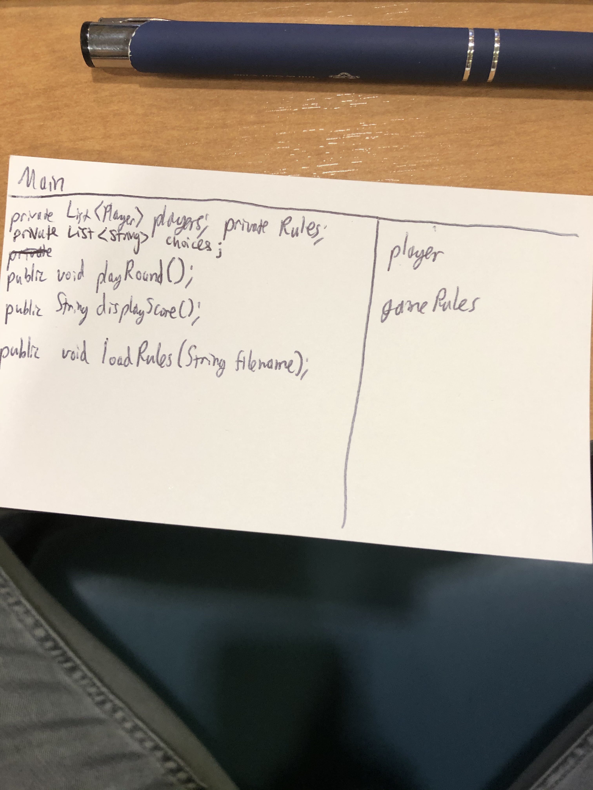
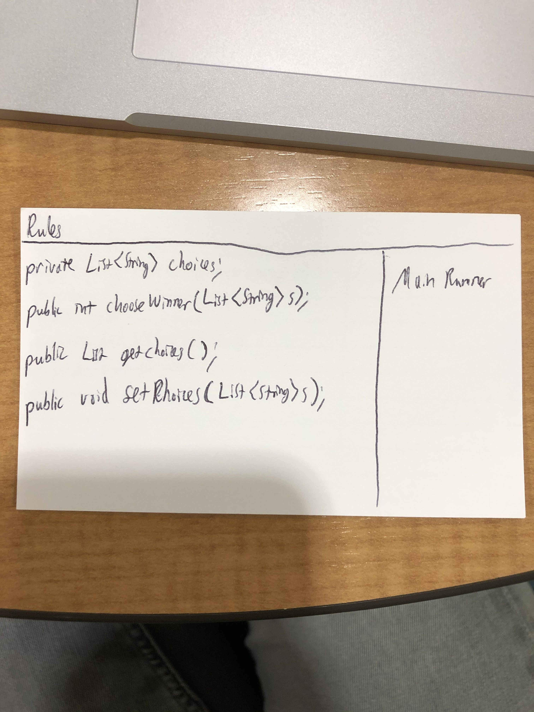

**- Discussion Notes for High-Level Design for RPS game**

* Player class: Players are objects in a main class that runs the game and acts like an arbitrator that checks the outcome of a round.

* Players receive list/array of possible choices to choose from, makes a choice, knows its own score.

* Rules class: Determines who wins out of all of the guesses (perhaps a list). Separate class to promote future flexibility.

* Main class: List of players, some access to rules/game choices. Takes a data file, calls a method in the rules class to set the rules/choices. Also prints out scores for all players.

* Assumption is that for player counts more than 2, rules on how to handle scoring will be provided.

See CRC section below for more information.

**- CRC:**





**- Use cases:** 
* A new game is started with two players, their scores are reset to 0.
```java
Player p1 = new Player(“human”);
Player p2 = new Player(“human”);
players.add(p1);
players.add(p2);
for (Player p: players) {
p.setScore(0);
}
```
* A player chooses his RPS "weapon" with which he wants to play for this round.
```java
choices.clear();
for(Player p : players){
	choices.add(p.makeChoice(Rules.getChoices()));
}
```
```java
System.out.println(“Your choices are: “);
for(int i = 0; i < choices.size(); i++) {
	System.out.println(“”+(int)(i+1)+”: “+choices.get(i));
}
System.out.println(“\nPlease enter the number of your choice: “);
Scanner keyboard = new Scanner(System.in);
return choices.get(keyboard.nextInt()); //error handling needs to happen, but this is the idea

```


* Given two players' choices, one player wins the round, and their scores are updated.
```java
public void playRound(){
	int winner = rules.chooseWinner(choices);
	System.out.println(“Player ” + (winner+1) + “ wins!”);
	players.get(winner).setScore(players.get(winner).getScore() + 1);

}
```

* A new choice is added to an existing game and its relationship to all the other choices is updated.
```java
ArrayList<String> newRules = rules.getChoices();
newRules.append(“new choice 1”);
newRules.append(“new choice 2”); //game must have an odd number of choices
rules.setChoices(newRules);
```

* A new game is added to the system, with its own relationships for its all its "weapons".
```java
loadRules(“newgame.txt”);
```

Inside loadRules:
```java
//some file reading code that puts the strings from that file in a list//
rules.setRules(newRulesList);
```
